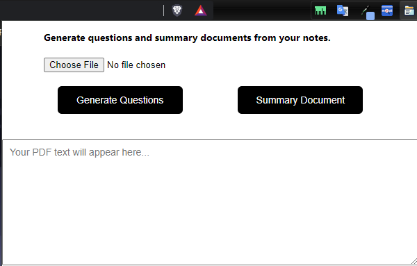

Visit our website: https://quickly-summarizer.vercel.app/

Note: This website is the UI of the extensions, if you want to use my extensions, use the following instructions:

1. In chrome or any browsers, go to: “Browser-Name”://extensions/ ( For example: chrome://extensions/)
2. Turn on Developer Mode.
3. Click “Load unpacked”, use folder ‘tool’.
4. Then Click Extension icon and use extension.

In the near future, i will give you a complete Quickly summarizer app, not the Extension version only.
If you want to contact me, please email: nguyenducthienfu@gmail.com

